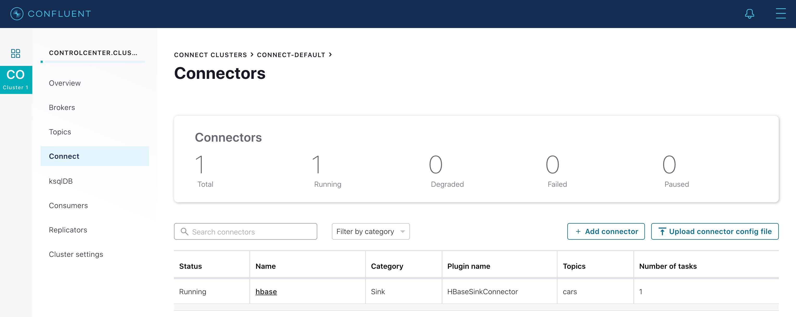

# Confuguration - Confluent Apache HBase Sink Connector

Reference: https://docs.confluent.io/current/connect/kafka-connect-hbase/index.html

## Install
```
$ confluent-hub install confluentinc/kafka-connect-hbase:latest
The component can be installed in any of the following Confluent Platform installations: 
  1. /opt/confluent (based on $CONFLUENT_HOME) 
  2. /opt/confluent (where this tool is installed) 
Choose one of these to continue the installation (1-2): 1
Do you want to install this into /opt/confluent/share/confluent-hub-components? (yN) y

 
Component's license: 
Confluent Software Evaluation License 
https://www.confluent.io/software-evaluation-license 
I agree to the software license agreement (yN) y

Downloading component Kafka Connect Apache HBase Sink Connector 1.0.5, provided by Confluent, Inc. from Confluent Hub and installing into /opt/confluent/share/confluent-hub-components 
Detected Worker's configs: 
  1. Standard: /opt/confluent/etc/kafka/connect-distributed.properties 
  2. Standard: /opt/confluent/etc/kafka/connect-standalone.properties 
  3. Standard: /opt/confluent/etc/schema-registry/connect-avro-distributed.properties 
  4. Standard: /opt/confluent/etc/schema-registry/connect-avro-standalone.properties 
  5. Based on CONFLUENT_CURRENT: /tmp/confluent.3sl78wkr/connect/connect.properties 
Do you want to update all detected configs? (yN) y

Adding installation directory to plugin path in the following files: 
  /opt/confluent/etc/kafka/connect-distributed.properties 
  /opt/confluent/etc/kafka/connect-standalone.properties 
  /opt/confluent/etc/schema-registry/connect-avro-distributed.properties 
  /opt/confluent/etc/schema-registry/connect-avro-standalone.properties 
  /tmp/confluent.3sl78wkr/connect/connect.properties 
 
Completed 
```

## Other Required Installation

`jq` command is must be installed to allow Kafka Connect perse json.
```
$ sudo yum -y install epel-release
$ sudo dnf install https://dl.fedoraproject.org/pub/epel/epel-release-latest-8.noarch.rpm
$ sudo dnf upgrade
$ sudo rpm -ivh https://dl.fedoraproject.org/pub/epel/epel-release-latest-7.noarch.rpm
$ sudo subscription-manager repos --enable "rhel-*-optional-rpms" --enable "rhel-*-extras-rpms"
$ sudo yum update
$ sudo yum install snapd
$ sudo systemctl enable --now snapd.socket
$ sudo ln -s /var/lib/snapd/snap /snap
$ sudo snap install jq
```
Reference: [How to install jq on Red Hat Enterprise Linux](https://snapcraft.io/install/jq/rhel)


## Check Kafka Connect is Running

```
[ec2-user@ip-10-0-0-209 ~]$ confluent local status
    The local commands are intended for a single-node development environment
    only, NOT for production usage. https://docs.confluent.io/current/cli/index.html

control-center is [UP]
ksql-server is [UP]
connect is [UP]
kafka-rest is [UP]
schema-registry is [UP]
kafka is [UP]
zookeeper is [UP]
```
If it is not running, you can start `connect` as follows.

```
$ confluent local start connect
    The local commands are intended for a single-node development environment
    only, NOT for production usage. https://docs.confluent.io/current/cli/index.html

Using CONFLUENT_CURRENT: /tmp/confluent.3sl78wkr
zookeeper is already running. Try restarting if needed
kafka is already running. Try restarting if needed
schema-registry is already running. Try restarting if needed
Starting connect
connect is [UP]
```


## Start HBase Connector

```
[ec2-user@ip-10-0-0-209 ~]$ confluent local load hbase -- -d hbase-qs.json
    The local commands are intended for a single-node development environment
    only, NOT for production usage. https://docs.confluent.io/current/cli/index.html

{
  "name": "hbase",
  "config": {
    "topics": "cars",
    "tasks.max": "1",
    "connector.class": "io.confluent.connect.hbase.HBaseSinkConnector",
    "key.converter": "org.apache.kafka.connect.storage.StringConverter",
    "value.converter": "org.apache.kafka.connect.storage.StringConverter",
    "confluent.topic.bootstrap.servers": "localhost:9092",
    "confluent.topic.replication.factor": "1",
    "hbase.zookeeper.quorum": "10.0.0.78",
    "hbase.zookeeper.property.clientPort": "2181",
    "auto.create.tables": "true",
    "auto.create.column.families": "true",
    "table.name.format": "cars",
    "name": "hbase"
  },
  "tasks": [],
  "type": "sink"
}
```
Once it is started, you can check on http://<your host>:9021
  


