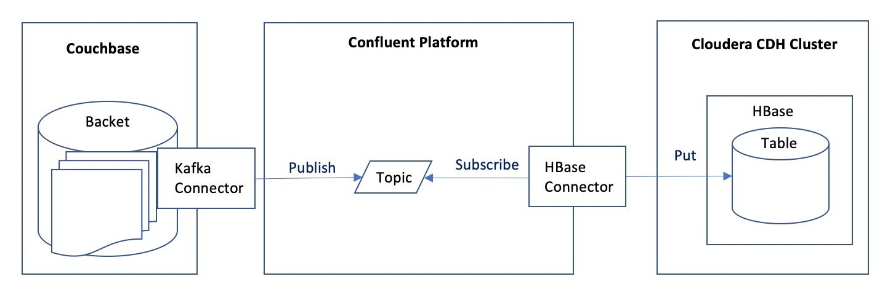

# Couchbase, Confluent Kafka, and HBase

This covers the following items.
- Setup Couchbase Kafka Connector
- Setup Confluent Platform
- Setup Confluent HBase Connector

## Overview Diagram



## Confluent System Requirements

https://docs.confluent.io/current/installation/system-requirements.html

## Environment
I confirmed with the following environment

- Cloud: AWS

### Couchbase
- AMI: RHEL-7.7_HVM-20191119-x86_64-2-Hourly2-GP2
- Instance Type: t2.medium

### Confluent
- AMI: RHEL-7.7_HVM-20191119-x86_64-2-Hourly2-GP2
- Instance Type: t2.xlarge

*Please note that Confluent Platform is resource-intensive. You will fail to start HBase Connector without enough memory.*

### Cloudera

You can prepare your Cloudera cluster using the script maintained in my repository, [Single Node CDH Cluster](https://github.com/YoshiyukiKono/SingleNodeCDHCluster).

## Couchbase Setup

In this repository, we assume that you already have a Couchbase cluster to which you will setup Kafka Connector.

Optionally, you may refer to my shell scripts for Couchbase Cluster preparetion on AWS below.

[couchbase-aws-scripts](https://github.com/YoshiyukiKono/couchbase-aws-scripts)

## Confluent Platform Setup

[1_1_confluent_kafka_setup.md](1_1_confluent_kafka_setup.md)

## Kafka Connector Setup

### Install

[2_1_couchbase_kafka-connector_install.md](2_1_couchbase_kafka-connector_install.md)

### Configuration

[2_2_couchbase_kafka-connector_config.md](2_2_couchbase_kafka-connector_config.md)

### Run Kafka Connector

After you restart your host, you need to run Confluent Platform (No need to run Couchbase Server manually).
```
cd $KAFKA_CONNECT_COUCHBASE_HOME
env CLASSPATH=lib/* \
    connect-standalone.sh $KAFKA_CONNECT_COUCHBASE_HOME/connect-confluent.properties \
                       etc/car-source.properties
```

## HBase Connector Setup

### Configuration

[1_2_conflluent_hbase_connector_setup.md](1_2_conflluent_hbase_connector_setup.md)


### Run Confluent Platform

After you restart your host, you need to run Confluent Platform (No need to register HBase Connector again).
```
$ confluent local start
```

## Check Data Stream

Login to your Cloudera CDH Cluster and check the data in HBase.

```
$ hbase shell
...
> scan 'cars'
```
When you import data to Couchbase, you will find the same data in HBase in real-time.

```
$ cbimport json -c couchbase://127.0.0.1 -u Administrator -p couchbase -b cars -d file://ten_cars.json  -f lines -g '#UUID#'
```
